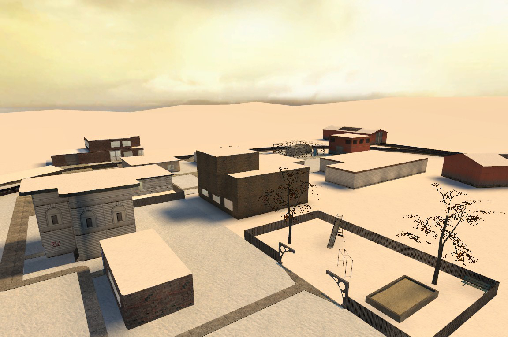
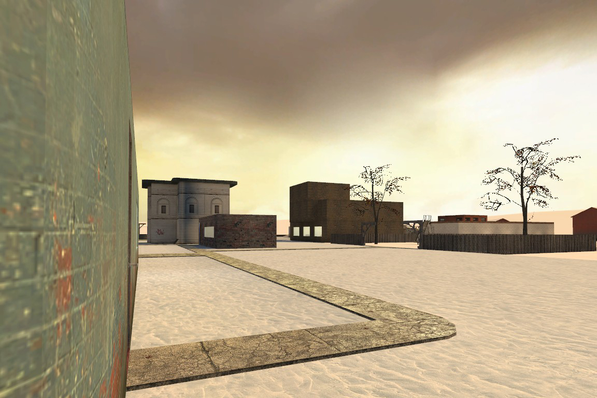
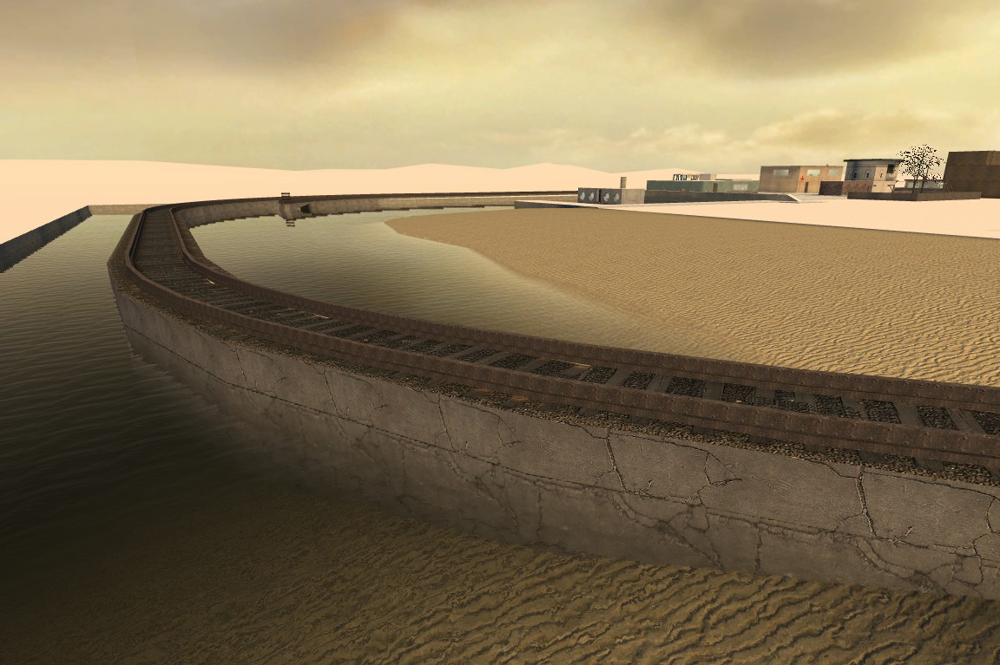
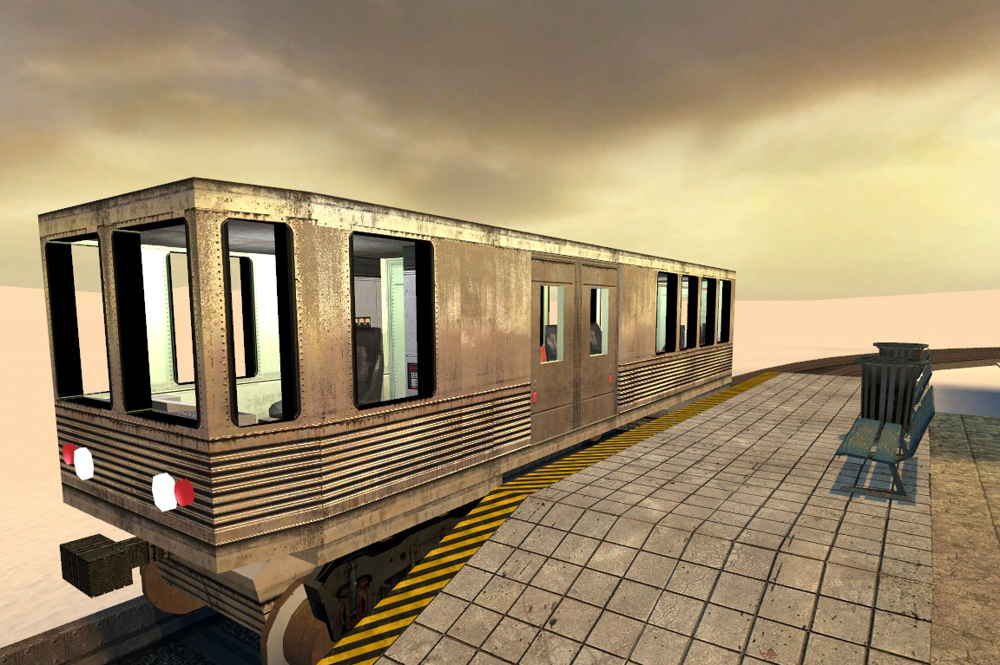

# rp_d2city

A winter roleplay map for small servers, everything is nearby and easily accessible.

Created by [unendingPattern](https://github.com/unendingPattern) with some additional help.

**Features:**

*   Very small.
*   Relatively flat, thus very easy to use for building and/or build-RP.
*	Multiple office buildings, civilian living spaces, playground, two train hangars, power station, graveyard, nightclub.
*   Special lighting, which was selected to make your eyes be less tired when playing long game sessions.
*	Small overground rail system with multiple stops.
*	Train can be intentionally derailed into water.

**Help/Contributors:**

*   [Black Phoenix](http://steamcommunity.com/profiles/76561197982559015/)
*   Unisaga/Moolant

**Download:** *Not currently available*

      
